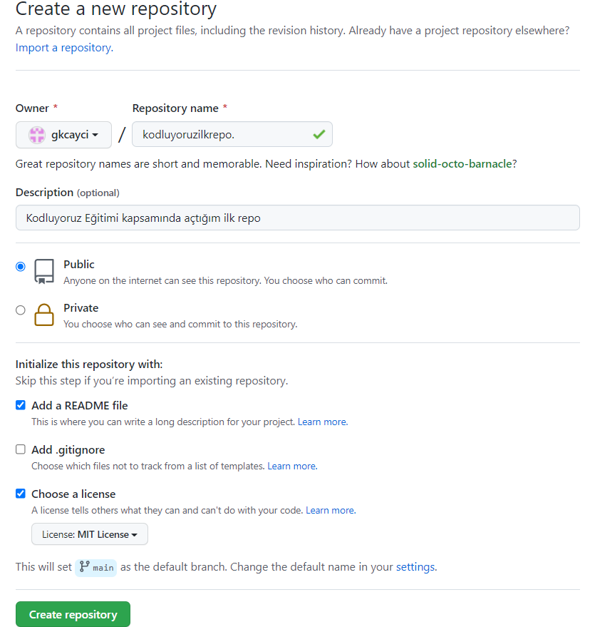

# Kodluyoruz İlk Repo

Bu repo [Kodluyoruz](https://www.patika.dev/tr) veri analizi eğitimi için oluşturduğumuz ilk repo. İçerisinde bir ader README bir adet de index.html barındırıyor.



## Installation

Öncelikle projeyi clonelayın. (Buraya sizin reponuzdan aldığınız link gelecek)

```bash
git clone https://github.com/gkcayci/kodluyoruzilkrepo.git
```

## Usage

Projeyi cloneladıktan sonra Visual Studio Code programında açınız.

Linux için:
```linux
cd kodluyoruzilkrepo
code .
```
## Contributing
Pull requestler kabul edilir. Büyük değişiklikler için, lütfen önce neyi değiştirmek istediğinizi tartışmak için bir konu açınız.


## License
[MIT](https://choosealicense.com/licenses/mit/)